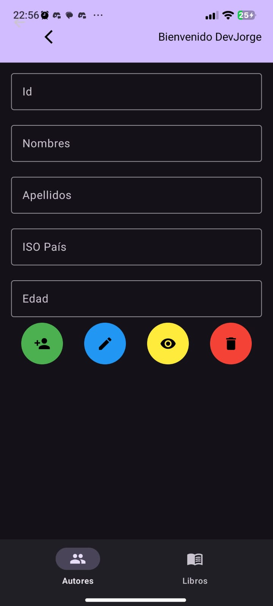

# Autores y Libros - Aplicación Móvil con SQLite - By Jorge Rosero

Esta aplicación de Android permite gestionar autores y sus libros utilizando SQLite para el almacenamiento de datos. A continuación, se describen las principales pantallas y funcionalidades de la aplicación, acompañadas de capturas de pantalla.
Además, muestra un resumen del proceso del CR

## Tabla de Contenidos
1. [Pantalla Principal](#pantalla-principal)
2. [Pantalla con Datos de Usuario](#pantalla-de-inicio-de-sesión)
3. [Gestión de Autores](#gestión-de-autores)
   - [Crear Autor](#crear-autor)
   - [Actualizar Autor](#actualizar-autor)
   - [Eliminar Autor](#eliminar-autor)
4. [Gestión de Libros](#gestión-de-libros)
   - [Crear Libro](#crear-libro)
   - [Actualizar Libro](#actualizar-libro)
   - [Eliminar Libro](#eliminar-libro)
5. [Vista Maestro-Detalle de Autor](#vista-maestro-detalle-de-autor)

## Pantalla Principal


Una vez que el usuario ha iniciado sesión, se muestra la pantalla principal de la aplicación, desde la cual se puede acceder a las secciones de autores y libros.


## Pantalla de Inicio de Sesión


El usuario debe iniciar sesión para acceder a las funcionalidades de la aplicación. Una vez autenticado, el usuario puede gestionar autores y libros.


## Gestión de Autores

### Vista de Pantalla de Autores


Desupés de haber iniciado sesión, se puede ver un mensaje de bienvenida con el usuario en sesión, es decir, pasando información de un activity, a otro.
Además tenemos un bottom_navigation_bottom, para poder navegar entre los Fragments de Autores y Libros para realizar el Maestro-Detalle.

### Crear Autor


El usuario puede agregar un nuevo autor ingresando su información. Una vez guardado, el autor se añadirá a la lista de autores.

### Actualizar Autor


Permite modificar los detalles de un autor existente. El usuario puede actualizar la información del autor y guardarla en la base de datos.

### Eliminar Autor


El usuario puede eliminar un autor existente de la base de datos. La lista de autores se actualizará automáticamente para reflejar el cambio.

## Gestión de Libros

### Crear Libro
#### Ejemplo: La Ilíada


#### Ejemplo: La Odisea


La funcionalidad de crear libro permite al usuario añadir un nuevo libro a la base de datos asociado con un autor específico.

### Actualizar Libro


El usuario puede editar la información de un libro existente, permitiendo modificar detalles como el título, el año de publicación, y el número de páginas.

### Eliminar Libro


Permite eliminar un libro específico de la base de datos. La lista de libros se actualizará tras la eliminación.

## Vista Maestro-Detalle de Autor


Esta vista muestra la información detallada de un autor específico junto con los libros relacionados. Desde esta vista, el usuario puede ver y gestionar los libros de un autor en particular.

---

Este repositorio muestra las pantallas de una aplicación sencilla para gestionar autores y libros en Android con SQLite. Los usuarios pueden realizar CRUD de datos de manera local en el dispositivo.

Para clonar y mirar el código podemos ejecutar el siguiente comando:
```
git clone https://github.com/DevJorgeRafael/autores-libros-sqlite-app-moviles
